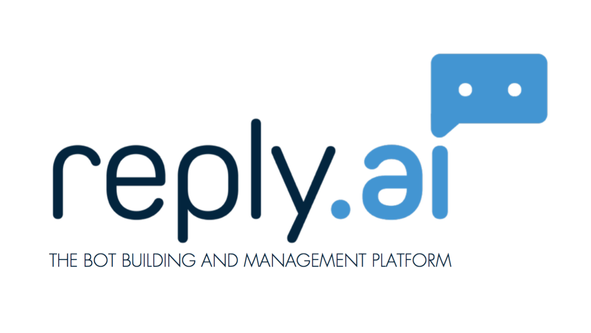

class: center, middle, inverse

# Hello Alexa!

---

class: inverse, center

# @javaguirre

[](https://www.reply.ai)

---

class: inverse, center

# Alexa


---

class: inverse, center

# Bots

* Automatiza tarea
* Imita comportamiento humano

[]()

#### [Wikipedia](https://es.wikipedia.org/wiki/Bot)

---

class: inverse, center

# Funcionalidad más usada

<b>Alexa, set timer five minutes</b>
<br/>
<b>Alexa, set alarm at 10am</b>


---

class: inverse, center

# Spotify

* Alexa, play late night jazz on spotify


---

class: inverse, center

# Futuro, asistentes conversacionales

* Google Home en Modern Family
* Alexa en MR Robot

https://www.youtube.com/watch?v=TaY9zt_qx_c

---

class: inverse, center

# Desarrollo con Alexa


---

class: inverse, center

# Desarrollo con Alexa (II)


---

class: inverse, center

# Tres componentes

* Skill, es una aplicación de Alexa
* Intent, es una acción que queremos que ejecute
* Slot, es un dato necesario para llevar a cabo la acción

---

class: inverse, center

# Cómo funciona

* Alexa, ask "skill" to do "something"
* Alexa, "something" with "skill"

---

class: inverse, center

# Cómo funciona (II)

* Crear skill
* Definir Intents y slots
* Desarrollar una aplicación

---

class: inverse, center

# Crear skill

* [Amazon developer portal](https://developer.amazon.com/edw/home.html#/)
* Crear Alexa skill
* Decidir palabra de apertura

---

class: inverse, center

# Definir intents y slots


---

class: inverse, center

# Definir frases para intents


---

class: inverse, center

# Ejemplo de código


---

class: inverse, center

# Ejemplo de funcionamiento


---

class: inverse, center

# Contras actuales

* App y dispositivo no disponible todavia
* Idiomas ingles y aleman


---

class: inverse, center

# Contras actuales (II)

* Seguridad


---

class: inverse, center

# Vamos a por Cervezas!


---

class: inverse, center

# Hay más


---

class: inverse, center

# API.AI

* Conversational User Experience Platform
* Google


---

class: inverse, center

# Conceptos

* Intents, la acción a ejecutar
* Entities, los datos necesarios para ejecutar la acción

---

class: inverse, center

# Uso

* ¿Qué tiempo hace hoy en Córdoba?

```
Intent: informacion_tiempo
Entities: fecha: hoy, localizacion: Córdoba, ES
```

* Hoy está soleado, tendremos 25 grados de máxima

---

class: inverse, center

# Intents


---

class: inverse, center

# Entities


---

class: inverse, center

# Entrenamiento


---

class: inverse, center

# Mucho más

* Canales de mensajería (Telegram, Facebook)
* Dominios, grupos de acciones empaquetados
* SDK, Webhooks...

---

class: inverse, center, middle
background-image: url(./images/background2.jpg)
background-size: contain
background-repeat: no-repeat
background-position: center

# Gracias
<p class="clear"></p>
#### Javier Aguirre [@javaguirre](https://javaguirre.me)
#### [Github](https://github.com/javaguirre) | [Twitter](https://twitter.com/javaguirre)
